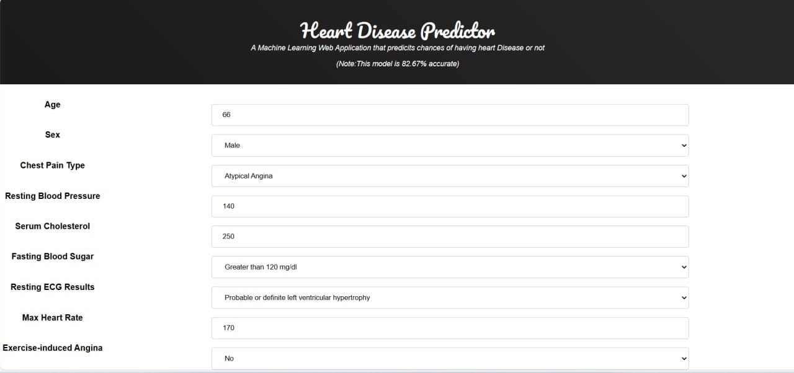

# ⚡ Heart Disease Detection
### Kindly Star this Repository ⚡

## Mail to : suriyaa2002@gmail.com for access to Full Project Report and Full Project Code.
### This does not have all the required code files. Mail me to get all the files

Heart Disease Detection is a comprehensive application designed to detect the presence of heart disease based on several risk factors. The risk factors included  
**Attribute Information:**
1. age
2. sex
3. chest pain type (4 values)
4. resting blood pressure
5. serum cholestoral in mg/dl
6. fasting blood sugar > 120 mg/dl
7. resting electrocardiographic results (values 0,1,2)
8. maximum heart rate achieved
9. exercise induced angina
10. oldpeak = ST depression induced by exercise relative to rest
11. the slope of the peak exercise ST segment
12. number of major vessels (0-3) colored by flourosopy
13. thal: 0 = normal; 1 = fixed defect; 2 = reversable defect

### Screenshots
Input Page 
:------------------:
 

Positive Output 
:------------------:|
 

Negative Output
:------------------:|
 

### Usage
1. Predicting whether u have heart disease based on 13 input metrics

#### Prerequisites :
- VS Code
- Python
- HTML, CSS, Js

## Build and Run Application

###### Heart Disease Predictor
